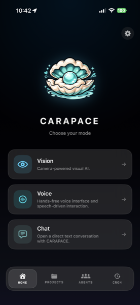

<p align="center">
  
</p>

<h1 align="center">CARAPACE</h1>

<p align="center">
  <strong>Your OpenClaw has eyes.</strong><br>
  <sub>Get your mom on OpenClaw in ten minutes.</sub>
</p>

<p align="center">
  <a href="https://github.com/mikeypaepke-gif/carapace-site/releases/latest"></a>
  <a href="https://carapace.info"></a>
  <a href="./LICENSE"></a>
  
  <a href="https://apps.apple.com/us/app/carapace/id6760282881"></a>
</p>

<p align="center">
  
</p>

<p align="center">
  <strong>Tested platforms</strong>
</p>

<p align="center">
  
  
  
  
  
  
  
</p>

---

This repository hosts the marketing site for [CARAPACE](https://carapace.info/)
and the open-source Linux installer (`install.sh`) that **layers Carapace on
top of an existing [OpenClaw](https://openclaw.ai/) gateway** on any Ubuntu /
Debian / Raspberry Pi or Rocky / Alma / Fedora host.

Carapace is a **shell on top of OpenClaw** — OpenClaw owns the AI runtime,
your provider, your API key, and the gateway service. Carapace adds
Tailscale serve, the iOS pairing layer, sentinel-bounded workspace prompts,
a status server, and helper commands. The carapace install is **non-
destructive on existing OpenClaw setups** — your chats, keys, and identity
files are preserved by design.

---

## What's in this repository

| Asset | License | Notes |
|---|---|---|
| `install.sh` | **MIT** — see [LICENSE](./LICENSE) | The Linux installer that layers Carapace onto an existing OpenClaw. Inspect it, fork it, send PRs. |
| `index.html`, `install/`, `assets/`, other web content | **MIT** | Marketing site deployed to Cloudflare Pages at carapace.info. |
| `status-server.js`, `cognitive/` | **MIT** | The status server + cognitive memory modules dropped at `~/.carapace/` during install. |
| `Carapace-*.dmg` | **Proprietary** | Signed macOS application binary. Distributed from this repo for convenience; **not** covered by the MIT license. |

**Not in this repository:**
- The macOS app source (closed-source).
- The iOS app source (closed-source; App Store distribution only).
- OpenClaw itself (separate project, [openclaw.ai](https://openclaw.ai)).

If you're looking to contribute, you're contributing to `install.sh`,
`status-server.js`, or the website. The Mac and iOS apps are closed and PRs
against them have nowhere to land — see [CONTRIBUTING.md](./CONTRIBUTING.md).

---

## The Linux installer (two commands)

Carapace is a **shell** on top of OpenClaw. Install OpenClaw first
(handles Node, npm, and the interactive provider/key/model wizard),
then layer Carapace on top:

```bash
# 1. Install OpenClaw (one-time, handles node + provider/key/model)
curl -fsSL https://openclaw.ai/install.sh | bash
# When asked "Hatch in Terminal? [y/N]" → say NO. The terminal hatch
# fires a chat turn that races Carapace's setup. Skip it.

# 2. Layer Carapace on top
curl -fsSL https://carapace.info/install.sh | bash
```

The Carapace installer (this repo's `install.sh`) walks through:

1. **Pre-flight** — verifies OpenClaw is installed and has at least one
   AI provider configured. Bails clean with actionable instructions if
   either is missing.
2. **Tailscale** — installs + interactive auth (one click in your browser).
3. **HTTPS verification** — confirms Tailscale serve will work over HTTPS.
4. **Gateway service** — installs/restarts the openclaw-gateway systemd
   unit with a dynamic openclaw path resolver (handles per-user nvm,
   sudo-npm system, and `~/.npm-global` install layouts).
5. **Status server** — drops `status-server.js` + cognitive memory modules
   at `~/.carapace/`, registers as systemd service, exposes `/agents`,
   `/cron`, `/sessions`, `/projects`, `/history`, `/chat`, etc.
6. **Helper commands** — installs `carapace-qr`, `carapace-onboard`,
   and `carapace-prune` to `/usr/local/bin/`.
7. **Health check** — port-bind probe (NOT `/health` curl, which is
   unreliable during the openclaw acpx runtime cold-start window).
8. **Carapace shell setup** — bumps `agents.defaults.timeoutSeconds`
   (180s, only if your value is lower), `bootstrapMaxChars` (50K),
   `gateway.trustedProxies` (Tailscale CGNAT range). Sentinel-bounded
   inserts into `AGENTS.md` + `MEMORY.md`. Preserves any non-default
   `IDENTITY.md`. Writes `PROJECTS.md` only if missing. Removes
   `BOOTSTRAP.md` only if it carries our sentinel or known openclaw-stock
   headers.
9. **Connect** — verifies gateway responsive, Tailscale serve active,
   workspace files present, gateway token present. Runs a single warmup
   chat completion against the configured provider so the user's first
   iOS message after pairing isn't stuck in cold-start. Then prints the
   QR + pair URL.
10. **Cron jobs** — installs nightly gateway restart (3am UTC), daily
    trajectory prune (3:30am UTC), and a 5-minute reaper for orphan
    `openclaw-tui` processes (see "Running the TUI on a remote VPS"
    below). All three keep the TUI/iOS surfaces snappy without the
    user managing anything manually.
11. **Cross-provider fallback validation** — if your `main` agent is
    configured with a single provider (the most common shape openclaw's
    setup wizard produces), Carapace adds a fallback model from a
    different provider you've authed. This prevents the TUI from
    silently hanging the next time your primary provider has a
    billing/network blip. Backed up to `openclaw.json.bak.fallback-*`
    before the edit; skipped if you've already configured a multi-
    provider setup.
12. **`/model` picker allowlist** — the openclaw TUI's `/model` command
    only shows models that appear in `agents.defaults.models`, but the
    setup wizard typically writes only 1-2 entries (whichever model the
    user picked at onboard). Carapace walks every model reference
    already in your `openclaw.json` (default model + fallbacks,
    compaction model, heartbeat model, per-agent overrides, custom
    provider model definitions) and adds any missing one to the
    picker's allowlist. Strictly user-data-driven — never invents a
    model you don't already have configured. Backed up to
    `openclaw.json.bak.allowlist-*` before the edit.

The installer is **idempotent** — safe to re-run any time you want to
refresh the workspace prompts, pull updated helper commands, or pick up
a newer Carapace release. Re-runs respect every safeguard above.

### Chat surface: iOS app, not the terminal

**On Linux — same model as Mac — the CARAPACE iOS app is the chat
surface.** The installer prints a QR; you scan it with the iOS app;
chat happens on your phone.

```bash
ssh root@your-vps
carapace-qr               # re-display the pair URL / QR if you closed it
```

Open CARAPACE on iPhone → Connect Server → scan. Done.

#### Why iOS-first

Carapace.app on Mac has always worked this way — menu bar icon for
ops, iPhone for chat. Linux mirrors it: the installer sets up
Tailscale, the gateway, the status server, and prints a QR. Your
phone is the chat client. SSH is for ops (config, gateway restarts,
logs).

For SSH-only operational work that doesn't need chat, the unaffected
commands all work:

```bash
openclaw doctor              # health check
openclaw config get|set|...  # configuration
openclaw gateway status      # gateway state
openclaw cron list           # scheduled jobs
carapace-qr                  # re-display pair URL
```

A `*/5 * * * * /usr/local/bin/carapace-reap-orphans` cron is installed
as a safety net for any orphan `openclaw-tui` processes that slip
through (e.g., users who run `--force-broken-tui` and lose their SSH
session). Reaped events are logged to syslog with tag
`carapace-reap-orphans`.

### Diagnostics — `/diag` endpoint

The status server exposes `GET /diag` (over your Tailscale URL or
locally at `http://127.0.0.1:18794/diag`) which returns a structured
health snapshot:

```json
{
  "status": "ok | warning | degraded",
  "issues": [{ "kind": "billing_failure", "count": 3, "last_at": "..." }],
  "gateway": { "ok": true, "status": "live" },
  "log_summary": { "errors": 0, "warnings": 2, "billing_failures": 3, "fallbacks_to_none": 3 },
  "tui": { "active": 1, "orphans": 0 },
  "model_config": {
    "main_primary": "anthropic/claude-sonnet-4-6",
    "main_providers_count": 2,
    "auth_profiles": ["anthropic:default", "xai:default"]
  }
}
```

The iOS app reads this every minute to render its red/yellow/green
banner. Use it from the CLI when something feels off:

```bash
curl -s http://127.0.0.1:18794/diag | jq .
```

### What Carapace never touches

| File / state | Behavior |
|---|---|
| `~/.openclaw/agents/main/sessions/*.jsonl` (your chat history) | **Never touched** |
| `~/.openclaw/agents/main/agent/auth-profiles.json` (your API keys) | **Never touched** |
| Custom workspace files (`SOUL.md`, `USER.md`, `OPS.md`, `TASKS.md`, etc.) | **Never touched** |
| `IDENTITY.md` with a non-default Name field | **Never touched** (only seeds if openclaw's unfilled template) |
| `openclaw.json` config values larger than ours | **Never reduced** (caps only bump if your value is lower) |
| Existing Tailscale serve routes | **Never reset** (only adds) |

Want a snapshot before running? `tar czf ~/openclaw-backup.tar.gz -C ~ .openclaw`

### Tested on

| OS | Status |
|---|---|
| Debian 11 / 12 / 13 (cloud images) | ✅ |
| Ubuntu 20.04 / 22.04 / 24.04 LTS | ✅ (same apt-get path as Debian) |
| Raspberry Pi OS 64-bit (Bookworm+) | ✅ |
| Rocky / Alma / RHEL 9 | ⚠️ dnf branch supported; validation in progress |
| Fedora 40+ | ⚠️ dnf branch supported; not yet exercised in the wild |

Pacman (Arch), apk (Alpine), and NixOS are not supported. PRs welcome.

### Piping `curl` to `bash` is trust

If you'd rather read the script before running it:

```bash
curl -fsSL https://carapace.info/install.sh -o install.sh
less install.sh   # read it
bash install.sh   # run it
```

---

## Security & liability

**The Software is provided AS IS, WITH ALL FAULTS, AND WITHOUT WARRANTY OF
ANY KIND.** You are solely responsible for the security of any system on
which you install or run the Software, for the management of your API
keys and AI-provider bills, for the configuration of Tailscale (or any
other remote-access tool you choose) and your network, and for any data
you process. The Author accepts **no liability** for data breaches,
privacy incidents, credential compromise, data loss, runaway bills,
third-party service outages, AI model output, or any other damages
arising from use of the Software.

Full terms, including warranty disclaimer, limitation of liability,
indemnification, and governing law, are in **[TERMS.md](./TERMS.md)**
(also published at <https://carapace.info/terms/>). By using the
Software, you agree to those Terms.

**Reporting a vulnerability:** please do *not* open a public GitHub
issue for security bugs. Follow the private-disclosure process in
[SECURITY.md](./SECURITY.md).

---

## Contributing

Scoped to `install.sh` and the marketing site. See
[CONTRIBUTING.md](./CONTRIBUTING.md).

---

## Deploying the website

The Cloudflare Pages project (`carapace`) is not git-connected — deploys are
manual via [`./deploy.sh`](./deploy.sh):

```bash
./deploy.sh
```

That script pushes any unpushed commits to GitHub, then runs
`wrangler pages deploy . --project-name=carapace --branch=main`.

---

## License

[MIT](./LICENSE) — applies to `install.sh` and the website content in this
repo. The macOS DMG and the iOS app are proprietary.
