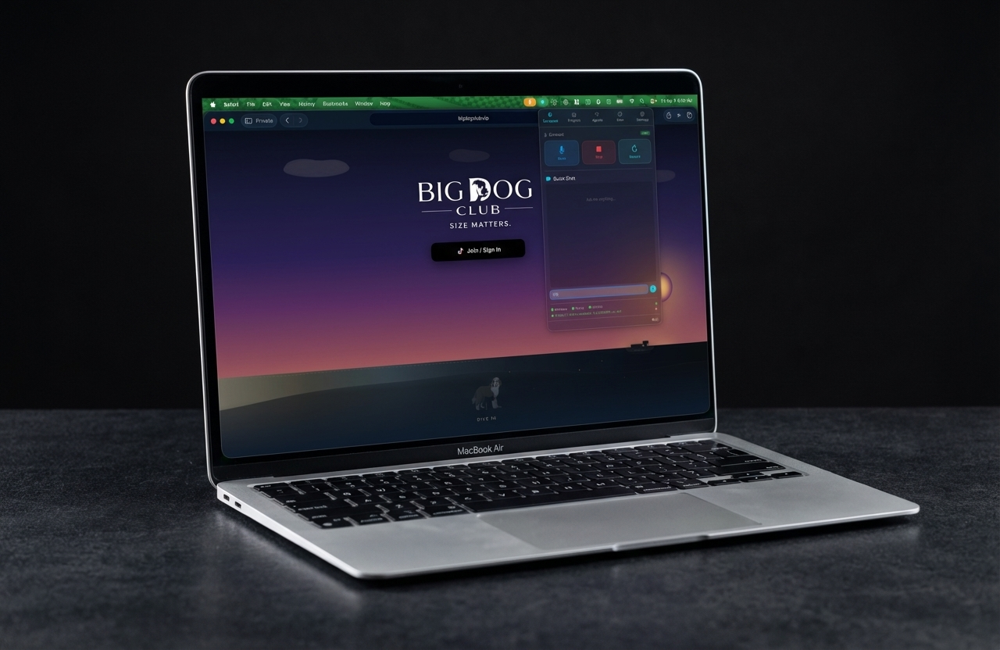

<p align="center">
  
</p>

<h1 align="center">CARAPACE</h1>

<p align="center">
  <strong>Your AI. Your machine. Your rules.</strong><br>
  <sub>We're just helping you feed it the data it's craving.</sub>
</p>

<p align="center">
  <a href="https://carapace.info"></a>
  <a href="./LICENSE"></a>
  
  <a href="https://apps.apple.com/us/app/carapace/id6760282881"></a>
</p>

<p align="center">
  
</p>

---

This repository hosts the marketing site for [CARAPACE](https://carapace.info/)
and the open-source Linux installer (`install.sh`) that provisions a headless
[OpenClaw](https://openclaw.ai/) gateway on any Ubuntu / Debian / Raspberry Pi
or Rocky / Alma / Fedora host.

---

## What's in this repository

| Asset | License | Notes |
|---|---|---|
| `install.sh` | **MIT** — see [LICENSE](./LICENSE) | The one-liner Linux installer. Inspect it, fork it, send PRs. |
| `index.html`, `install/`, `assets/`, other web content | **MIT** | Marketing site deployed to Cloudflare Pages at carapace.info. |
| `Carapace-*.dmg` | **Proprietary** | Signed macOS application binary. Distributed from this repo for convenience; **not** covered by the MIT license. |

**Not in this repository:**
- The macOS app source (closed-source).
- The iOS app source (closed-source; App Store distribution only).

If you're looking to contribute, you're contributing to `install.sh` or the
website. The Mac and iOS apps are closed and PRs against them have nowhere to
land — see [CONTRIBUTING.md](./CONTRIBUTING.md).

---

## The Linux installer

```bash
curl -fsSL https://carapace.info/install.sh | bash
```

It walks the user through:

1. Prerequisites — installs `curl`, `python3`, `git`, `build-essential`
   (`gcc`/`g++`/`make`), `jq`, and `cron` on their behalf.
2. Node.js via `nvm`.
3. OpenClaw via `npm install -g openclaw`.
4. Tailscale for secure remote access to the gateway.
5. A confirm-or-re-enter loop on API-key entry so a typo doesn't require
   restarting the whole installer.
6. Provider picker (Gemini / Claude / OpenAI Codex via ChatGPT OAuth /
   OpenAI API / xAI / Skip).
7. QR-code pair with the Carapace iOS app.

The installer is idempotent — safe to re-run without breaking existing
pairings or authentication tokens.

### Tested on

| OS | Status |
|---|---|
| Debian 11 / 12 / 13 (cloud images) | ✅ |
| Ubuntu 20.04 / 22.04 / 24.04 LTS | ✅ (same apt-get path as Debian) |
| Raspberry Pi OS 64-bit (Bookworm+) | ✅ |
| Rocky / Alma / RHEL 9 | ⚠️ dnf branch supported; validation in progress |
| Fedora 40+ | ⚠️ dnf branch supported; not yet exercised in the wild |

Pacman (Arch), apk (Alpine), and NixOS are not supported. PRs welcome.

### Piping `curl` to `bash` is trust

If you'd rather read the script before running it:

```bash
curl -fsSL https://carapace.info/install.sh -o install.sh
less install.sh   # read it
bash install.sh   # run it
```

---

## Security & liability

**The Software is provided AS IS, WITH ALL FAULTS, AND WITHOUT WARRANTY OF
ANY KIND.** You are solely responsible for the security of any system on
which you install or run the Software, for the management of your API
keys and AI-provider bills, for the configuration of Tailscale (or any
other remote-access tool you choose) and your network, and for any data
you process. The Author accepts **no liability** for data breaches,
privacy incidents, credential compromise, data loss, runaway bills,
third-party service outages, AI model output, or any other damages
arising from use of the Software.

Full terms, including warranty disclaimer, limitation of liability,
indemnification, and governing law, are in **[TERMS.md](./TERMS.md)**
(also published at <https://carapace.info/terms/>). By using the
Software, you agree to those Terms.

**Reporting a vulnerability:** please do *not* open a public GitHub
issue for security bugs. Follow the private-disclosure process in
[SECURITY.md](./SECURITY.md).

---

## Contributing

Scoped to `install.sh` and the marketing site. See
[CONTRIBUTING.md](./CONTRIBUTING.md).

---

## Deploying the website

The Cloudflare Pages project (`carapace`) is not git-connected — deploys are
manual via [`./deploy.sh`](./deploy.sh):

```bash
./deploy.sh
```

That script pushes any unpushed commits to GitHub, then runs
`wrangler pages deploy . --project-name=carapace --branch=main`.

---

## License

[MIT](./LICENSE) — applies to `install.sh` and the website content in this
repo. The macOS DMG and the iOS app are proprietary.
